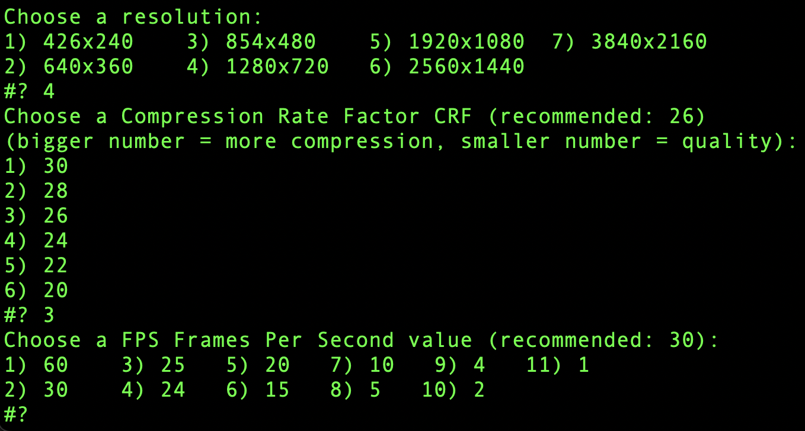

Media tools
===========

| [video-reencode.sh](video-reencode/video-reencode.sh) |  |
|---|---|
| It converts the video files (mp4, m4v, mkv, avi, mpg) found in the folder (and subfolders) to .mp4 format with the specified settings using ffmpeg.    It sets the configurations through a series of questions. It's almost like an ffmpeg GUI, but in the command line. |  |

- It preserves the folder structure. 
- It appends ".compressed.mp4" to the end of the filenames. 
- Deletes old files.

Usage:

- Place the script in a folder where video files are located
- Make the script executable with `chmod +x script.sh`
- Run the script with `./script.sh`

----
