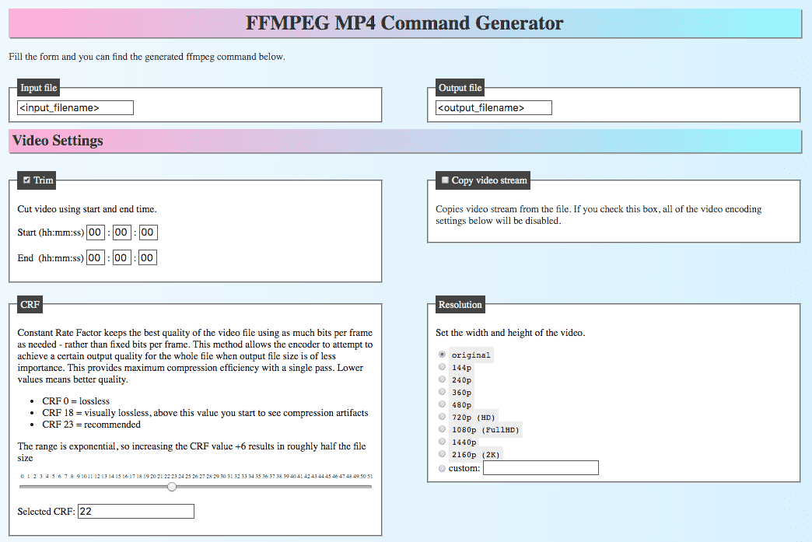
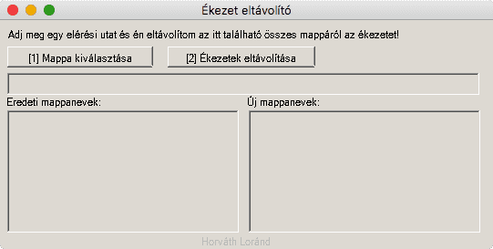

Media tools
===========

Useful bash/python scripts for manipulating media files (videos, images) with `ffmpeg`, `exiftool` or `yt-dlp`.

Usage of most scripts:

1. Place the script in a folder where media files (mp4, mp3...) are located. 
2. `chmod +x script.sh;`
3. `./script.sh`
4. Some scripts accept arguments in the format: `./script.sh <arg1> <arg2>`


[image-noise-remover](image-noise-remover/image-noise-remover.py)
----------------------------

This tool removes the noise from low-light images with image stacking. You need *multiple images*: you need an image sequence shot from a tripod, from the same position. The program merges the images, filtering out the noise.

Usage: 

```
python3 image-noise-remover.py  input_folder_with_images/  output.jpg
```


[video-reencode.sh](video-reencode/video-reencode.sh)
--------------------

It converts the video files (mp4, m4v, mkv, avi, mpg) found in the folder (and subfolders) to .mp4 format with the specified settings using ffmpeg.

It sets the configurations through a series of questions. It's almost like an ffmpeg GUI, but in the command line.

```text
Choose a resolution:
1) 426x240  2) 640x360   3) 854x480
4) 1280x720 5) 1920x1080 6) 2560x1440 7) 3840x2160
#? 2

Choose a Compression Rate Factor CRF (recommended: 26)
(bigger number = more compression, smaller number = quality):
1) 30  2) 28  3) 26
4) 24  5) 22  6) 20
#? 3

Choose a FPS Frames Per Second value (recommended: 30):
 1) 60   2) 30   3) 25   4) 24   5) 20
 6) 15   7) 10   8) 5    9) 4   10) 2   11) 1
...
```

- It preserves the folder structure. 
- It appends ".compressed.mp4" to the end of the filenames. 
- Deletes old files.

> Usage: Run the script in a folder that contains video files.

----

[rename-media-to-exif-datetime.sh](rename-media-to-exif-datetime/rename-media-to-exif-datetime.sh)
---------------------

Renames all media files (jpg,jpeg,heic,cr2,png,jfif,mov,mp4,m4v,mod,mpo,mpg,mpeg,avi) in the current folder and subfolders to the EXIF date and time in this format: YYYY-MM-DD HH-MM-SS.EXT using `exiftool`

```
something.jpg ---> 2024-07-27 19-15-19.jpg
videofile.MP4 ---> 2024-07-28 12-11-59.mp4
```

> Usage: Run the script in a folder that contains video files.


----

[remove-exif.sh](remove-exif/remove-exif.sh)
--------------------

Removes EXIF metadata from files in the current directory including subdirectories.

> Usage: Run the script in a folder that contains files.

----

[mp3-merge.sh](mp3-merge/mp3-merge.sh)
--------------------

Merges every .mp3 file in the current folder using ffmpeg into merged.mp3

```
part1.mp3 part2.mp3 part3.mp3 ---> merged.mp3
```

> Usage: Run the script in a folder that contains mp3 files.

----

[mp3-to-mp4.sh](mp3-to-mp4/mp3-to-mp4.sh)
--------------------

Converts mp3 file to mp4 video using the provided image file. Resolution = image resolution, FPS = 1.

```
audio.mp3 image.jpg ---> video.mp4
```

> Usage: `./script.sh <mp3 file> <image file>`

----

[convert-images-to-jpg](convert-images-to-jpg/convert-images-to-jpg.sh)
-----------------------

Convert exotic image formats to jpg.

> Usage: Run the script in a folder that contains image files.

----

[keygenmusic-to-mp3.sh](keygenmusic-to-mp3/keygenmusic-to-mp3.sh)
--------------------

This bash script converts every "keygen music" (.mod .xm .it .s3m .mtm .stm music tracker files) in the current folder to mp3 using VLC Media player. It supports every media format that VLC supports. Edit VLC executable path below according to your operating system.

```
keygenmusic.mod ---> keygenmusic.mp3
```

> Usage: Run the script in a folder that contains music tracker files.

----

[mp4-merge.sh](mp4-merge/mp4-merge.sh)
---------------------

Finds every MP4 file in current folder and subfolders and merges them into a single .mp4 file. Filename: Parent-folder-name.mp4 File sorting: [Version sorting](https://www.gnu.org/software/coreutils/manual/html_node/Version-sort-overview.html)

Creates chapters for the merged video. Certain media players can use this information. *For example: In VLC, go to Playback menu > Chapters > Jump to chapter.*

```
Something/
   01_Introduction.mp4
   02_Installing.mp4
   03_First exercise.mp4
   ...
   ---> Something.mp4
```

> Usage: Run the script in a folder that contains mp4 files.

----

[find-media-files](find-media-files/find-media-files.sh)
----------------------

Finds every media file based on file header bytes.

> Usage: Run the script in a folder that contains media files.

----

[filematcher.py](filematcher/filematcher.py)
---------------------

The script scans two specified folders to identify and match files that have identical contents, even if their names differ. It provides a report of unmatched files and any files that could not be accessed due to permission issues.

> Usage: `python script.py <folder1> <folder2>`

----

[youtube-archive.sh](youtube-archive/youtube-archive.sh)
-------------------------

Downloads a YouTube video with yt-dlp at a user-specified resolution. Prints downloaded filename.

> Usage: `./script.sh "<Youtube URL>" <resolution 144/240/360/480/720/1080/1440/2160/4320>`

----

[youtube-archive-cut.sh](youtube-archive/youtube-archive-cut.sh)
-------------------------

Downloads a YouTube video with yt-dlp at a user-specified resolution and filename. Optionally trims the video. Interactively asks the settings.

> Usage: `./script.sh "<Youtube URL>"`


----

[youtube-archive-list.sh](youtube-archive/youtube-archive-list.sh)
-------------------------

Downloads multiple YouTube videos. URLs are provided in a text file, one per line.

> Usage: `./script.sh <youtubeUrlList.txt> <resolution 144/240/360/480/720/1080/1440/2160/4320>`

----

[archive-org-url-list-checker.sh](archive-org-tools/archive-org-url-list-checker.sh)
-------------------------

Checks if the URLs found in the specified .txt file are archived on archive.org

> Usage: `./script.sh <URLlist.txt>`


[compress-pdf](compress-pdf/compress-pdf.sh)
-------------------------

This tool compresses a PDF file using Ghostscript, targeting a quality suitable for eBooks, and outputs the compressed file with a `.compressed.pdf` suffix.


> Usage: `./script.sh <document.pdf>`


[ffmpeg-command-generator](https://hlorand.github.io/media-tools/ffmpeg-command-generator/)
-------------------------

This tool helps you to easily generate FFmpeg commands to convert MP4 video files. Just select the settings by filling out a form, and copy the generated command. 

> Visit: https://hlorand.github.io/media-tools/ffmpeg-command-generator/




[folder-accent-remover](folder-accent-remover/folder-accent-remover.exe)
-------------------------------------

This Windows program removes the accents from the charactes from folder names. Example:

```
c:\dir\Árvíztűrő
c:\dir\tükörfúrógép

 |         |
 V becomes V

c:\dir\Arvizturo
c:\dir\tukorfurogep
```


